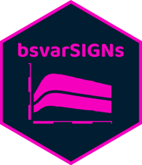

<!-- README.md is generated from README.Rmd. Please edit that file -->

# bsvarSIGNs <a href="https://bsvars.github.io/bsvarSIGNs/"></a>

An **R** package for Bayesian Estimation of Structural Vector
Autoregressions Identified by Sign, Zero, and Narrative Restrictions

<!-- badges: start -->

[](https://cran.r-project.org/package=bsvarSIGNs)
[](https://github.com/bsvars/bsvarSIGNs/actions/workflows/R-CMD-check.yaml)
<!-- badges: end -->

Implements state-of-the-art algorithms for the Bayesian analysis of
Structural Vector Autoregressions identified by sign, zero, and
narrative restrictions. The core model is based on a flexible Vector
Autoregression with estimated hyper-parameters of the Minnesota prior
and the dummy observation priors as in [Giannone, Lenza, Primiceri
(2015)](http://doi.org/10.1162/REST_a_00483). The sign restrictions are
implemented employing the methods proposed by [Rubio-Ramírez, Waggoner &
Zha (2010)](http://doi.org/10.1111/j.1467-937X.2009.00578.x), while
identification through sign and zero restrictions follows the approach
developed by [Arias, Rubio-Ramírez, & Waggoner
(2018)](http://doi.org/10.3982/ECTA14468). Furthermore, our tool
provides algorithms for identification via sign and narrative
restrictions, in line with the methods introduced by [Antolín-Díaz and
Rubio-Ramírez (2018)](http://doi.org/10.1257/aer.20161852). Users can
also estimate a model with sign, zero, and narrative restrictions
imposed at once. The package facilitates predictive and structural
analyses using impulse responses, forecast error variance and historical
decompositions, forecasting and conditional forecasting, as well as
analyses of structural shocks and fitted values. All this is
complemented by colourful plots, user-friendly summary functions, and
comprehensive documentation. The **bsvarSIGNs** package is aligned
regarding objects, workflows, and code structure with the **R** package
**bsvars** by [Woźniak
(2024)](http://doi.org/10.32614/CRAN.package.bsvars), and they
constitute an integrated toolset.

<a href="mailto:bsvars@pm.me">

</a> <a href="https://github.com/bsvars/bsvarSIGNs">

</a> <a href="https://fosstodon.org/@bsvars">

</a> <a href="https://bsky.app/profile/bsvars.bsky.social">

</a>

## Features

#### Structural Vector Autoregressions

- All the models in the **bsvarSIGNs** package consist of the Vector
  Autoregressive equation, with autoregressive parameters `A` and error
  terms `E`, and the structural equation with a structural matrix `B`
  and shocks `U`

<!-- -->

        Y = AX + E           (VAR equation)
       BE = U                (structural equation)

- All the models feature a hierarchical Minnesota prior following the
  specification proposed by Giannone, Lenza, Primiceri (2015)
- The identification of the SVAR model is achieved by imposing:
  - sign restrictions on the structural matrix $\mathbf{B}$,
  - sign and zero restrictions on the zero-horizon impulse responses
    $\mathbf{\Theta}_0 = \mathbf{B}^{-1}$,
  - sign restrictions on the impulse responses at other horizons
    $\mathbf{\Theta}_i$ for $i = 1, 2, \ldots$,
  - sign restrictions on selected structural shocks $\mathbf{u}_t$,
  - two types of sign restrictions on the historical decompositions.

#### Simple workflows

- Specify the models using `specify_bsvarSIGN$new()` function
- Estimate the models using the `estimate()` method
- Predict the future using the `forecast()` method
- Provide structural analyses using **impulse responses**, forecast
  error variance decompositions, historical decompositions, and
  structural shocks using functions `compute_impulse_responses()`,
  `compute_variance_decompositions()`,
  `compute_historical_decompositions()`, and
  `compute_structural_shocks()` respectively
- Analyse the fitted values, time-varying volatility using functions
  `compute_fitted_values()` and `compute_conditional_sd()` respectively
- Use `plot()` and `summary()` methods to gain the insights into the
  core of the empirical problem.

#### Fast and efficient computations

- Blazingly fast computations are obtained by combining
  - the application of frontier econometric and numerical techniques,
    and
  - the implementation using compiled code written in **cpp**
- It combines the best of two worlds: the ease of data analysis with
  **R** and fast **cpp** algorithms
- The algorithms used here are very fast. But still, Bayesian estimation
  might take a little time. Look at our beautiful **progress bar** in
  the meantime:

<!-- -->

    **************************************************|
     bsvarSIGNs: Bayesian Structural VAR with sign,   |
                 zero and narrative restrictions      |
    **************************************************|
     Progress of simulation for 1000 independent draws
     Press Esc to interrupt the computations
    **************************************************|
    0%   10   20   30   40   50   60   70   80   90   100%
    [----|----|----|----|----|----|----|----|----|----|
    ***********************************

#### The hexagonal logo

This beautiful logo can be reproduced in R using [this
file](https://github.com/donotdespair/naklejki/blob/master/bsvarSIGNs/bsvarSIGNs.R).

<p>
</p>
<a href="https://bsvars.github.io/bsvarSIGNs/"></a>
<p>
</p>

## Examples

Replication of the results by [Arias, Rubio-Ramírez, & Waggoner
(2018)](http://doi.org/10.3982/ECTA14468).

``` r
# investigate the effects of the optimism shock
data(optimism)

# specify identifying restrictions:
# + no effect on productivity (zero restriction)
# + positive effect on stock prices (positive sign restriction)
sign_irf       = matrix(c(0, 1, rep(NA, 23)), 5, 5)

# specify the model
specification  = specify_bsvarSIGN$new(optimism * 100,
                                       p        = 4,
                                       sign_irf = sign_irf)

# estimate the model
posterior      = estimate(specification, S = 100)

# compute and plot impulse responses
irf            = compute_impulse_responses(posterior, horizon = 40)
plot(irf, probability = 0.68)
```

Replication of the results by [Antolín-Díaz and Rubio-Ramírez
(2018)](http://doi.org/10.1257/aer.20161852).

``` r
# investigate the effects of the contractionary monetary policy shock
data(monetary)

# specify identifying restrictions:
# + sign restrictions on the impulse responses at horizons from 0 to 5
sign_irf       = matrix(NA, 6, 6)
sign_irf[, 1]  = c(NA, -1, -1, NA, -1, 1)
sign_irf       = array(sign_irf, dim = c(6, 6, 6))

# + narrative sign restriction: the shock is positive in October 1979
sign_narrative = list(
  specify_narrative(start = 166, periods = 1, type = "S", sign = 1, shock = 1),
  specify_narrative(start = 166, periods = 1, type = "B", sign = 1, shock = 1, var = 6)
)

# specify the model
specification  = specify_bsvarSIGN$new(monetary       * 100,
                                       p              = 12,
                                       sign_irf       = sign_irf,
                                       sign_narrative = sign_narrative)

# estimate the model
posterior      = estimate(specification, S = 100)

# compute and plot impulse responses
irf            = compute_impulse_responses(posterior, horizon = 60)
plot(irf, probability = 0.68)
```

## Installation

#### The first time you install the package

You must have a **cpp** compiler. Follow the instructions from [Section
1.3. by Eddelbuettel & François
(2023)](https://cran.r-project.org/package=Rcpp/vignettes/Rcpp-FAQ.pdf).
In short, for **Windows:** install
[RTools](https://CRAN.R-project.org/bin/windows/Rtools/), for **macOS:**
install [Xcode Command Line
Tools](https://www.freecodecamp.org/news/install-xcode-command-line-tools/),
and for **Linux:** install the standard development packages.

#### Once that’s done:

Just open your **R** and type:

    install.packages("bsvarSIGNs")

The developer’s version of the package with the newest features can be
installed by typing:

    devtools::install_github("bsvars/bsvarSIGNs")

## Development

The package is under intensive development. Your help is most welcome!
Please, have a look at the
[roadmap](https://github.com/bsvars/bsvarSIGNs/milestones) and [report a
bug](https://github.com/bsvars/bsvarSIGNs/issues). Thank you!

## About the authors

**Xiaolei** is a PhD candidate at the University of Melbourne. He is
interested in Bayesian econometrics and time series analysis and is the
author and maintainer of the **bsvarSIGNs** package.

<a href="mailto:adamwang15@gmail.com">

</a> <a href="https://github.com/adamwang15">

</a> <a href="https://orcid.org/0009-0005-6192-9061">

</a> <a href="https://www.linkedin.com/in/xiaolei-adam-wang/">

</a>

**Tomasz** is a Bayesian econometrician and a Senior Lecturer at the
University of Melbourne. He develops methodology for empirical
macroeconomic analyses and programs in **R** and **cpp** using **Rcpp**.

<a href="mailto:twozniak@unimelb.edu.au">

</a> <a href="https://github.com/donotdespair">

</a> <a href="https://orcid.org/0000-0003-2212-2378">

</a> <a href="https://www.linkedin.com/in/tomaszwwozniak">

</a> <a href="http://scholar.google.com/citations?user=2uWpFrYAAAAJ&hl">

</a> <a href="https://arxiv.org/a/wozniak_t_1">

</a> <a href="https://fosstodon.org/@tomaszwozniak">

</a> <a href="https://bsky.app/profile/tomaszwozniak.bsky.social">

</a>
